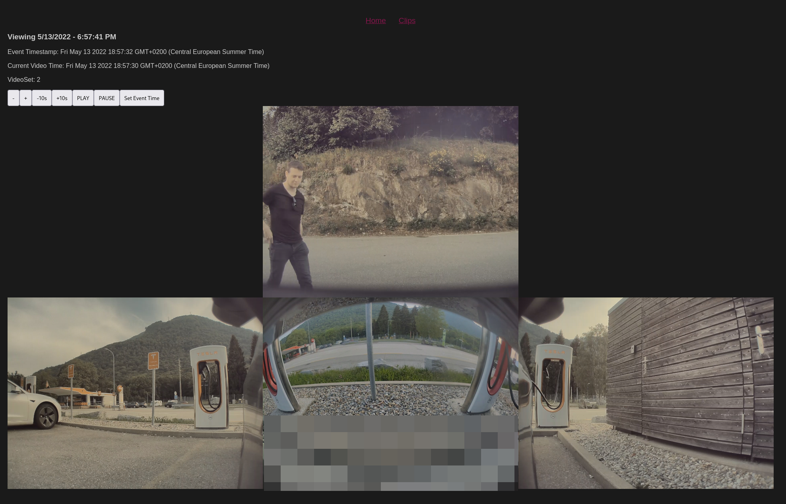

# tesla-sentry-viewer-frontend

A web interface to see your [Tesla](https://www.tesla.com/) [Sentry Mode](https://www.tesla.com/ownersmanual/model3/en_us/GUID-3C7A4D8B-2904-4093-9841-35596A110DE7.html) recordings on your computer.



## Getting Started

This project only takes care of being the frontend to [tesla-sentry-viewer](https://github.com/denysvitali/tesla-sentry-viewer).

To be able to see your Sentry clips on this web interface, you need to start the backend (tesla-sentry-viewer). There are multiple ways of doing that, but the easiest one is to use the pre-packaged Docker Images with `docker-compose`, so that you can run both the frontend _and_ the backend at the same time.

## Using Docker-Compose

### Requirements

- Docker
- `docker-compose`

### Starting the frontend and the backend

```bash
git clone https://github.com/denysvitali/tesla-sentry-viewer-frontend
cd tesla-sentry-viewer-frontend
```

Make sure the path to your USB is correctly set in `docker-compose.yml`, by default this is `/run/media/$USER/TESLADRIVE` and we then use `TeslaCam/SentryClips` as the path to the clips.

Once you have set the correct path, you can start the frontend and the backend with:

```bash
docker-compose up -d
```

You can now visit http://localhost:3000 and you should see your clips.


## Manually

### Requirements

- [`tesla-sentry-viewer`](https://github.com/denysvitali/tesla-sentry-viewer)
- Node.js 18.x+ (even though any Node.js version >= 16.15 should work)
- [Yarn](https://github.com/yarnpkg/yarn)
- [envsubst](https://www.gnu.org/software/gettext/manual/html_node/envsubst-Invocation.html) (optional, you can simply create a `public/config.json` file instead)

### Starting the backend

Start `tesla-sentry-viewer`:

```shell
tesla-sentry-viewer /run/media/$USER/TESLADRIVE/TeslaCam/SentryClips -l 0.0.0.0:8150
```

Confirm that the backend is working:

```
curl -v http://127.0.0.1:8150/api/v1/clips | jq .
```

You should now see a list of clips:

```json
{
  "events": [
    "2022-06-18_12-00-00",
    "2022-06-18_12-05-33"
  ]
}
```

### Starting the frontend

Create a configuration file for the frontend (`public/config.json`) as follows:

```json
{
    "backendEndpoint": "http://127.0.0.1:8150"
}
```

Then, start the frontend:

```shell
yarn install
# Generate the src/assets/config.json based on your environment variables:
make config
# Start the web app and listen on the default address, if available http://127.0.0.1:3000
yarn run dev
```

Visit http://127.0.0.1:3000 and confirm that by visiting "Clips" you can see your clips.
